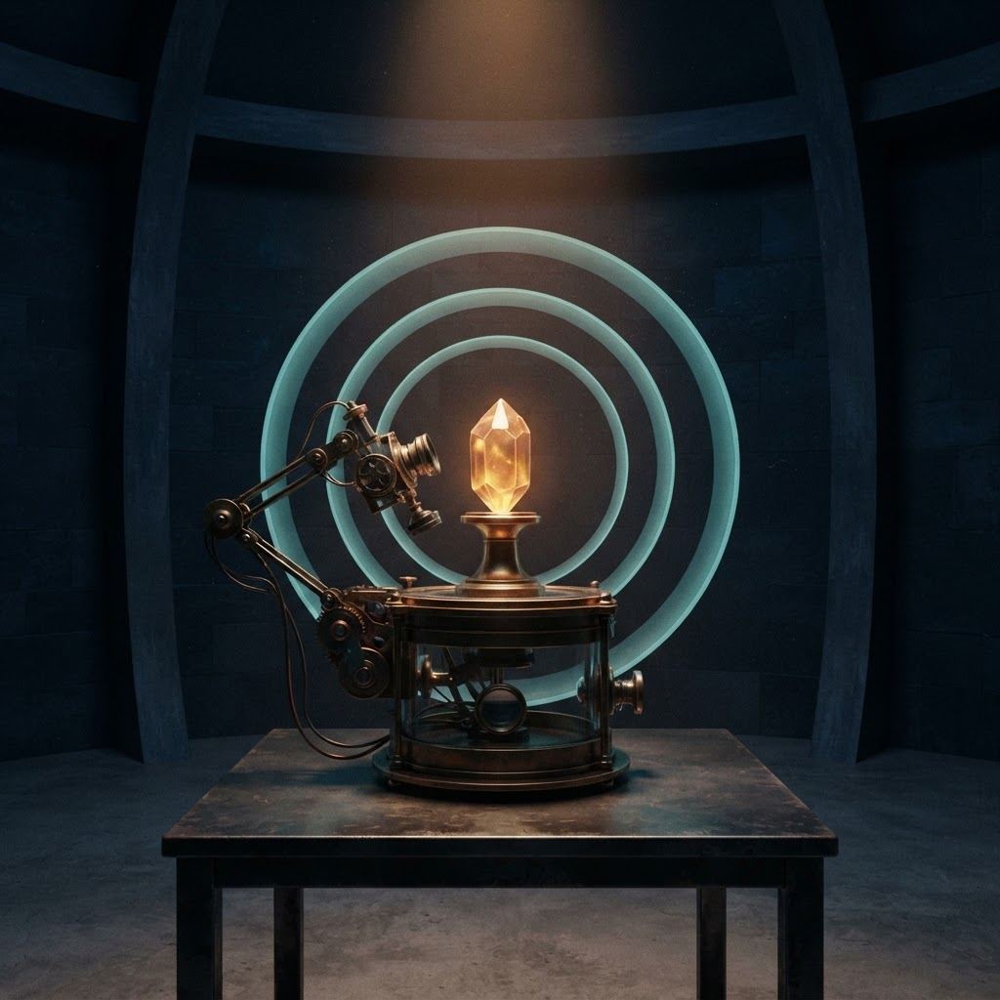

# Google Vertex Image Generation Smoke Test — 2026-08-10

## Result

APR generated and persisted a real 1024 × 1024 image through Google Vertex AI using
`gemini-3.1-flash-lite-image` at the `global` location. The final request completed in 3.908
seconds, used 213 prompt tokens and 1,120 image-output tokens, and has an estimated standard-tier
cost of **US$0.03365325**.



Final artifact:

- MIME type: `image/jpeg`
- Size: 1024 × 1024, 120,725 bytes
- SHA-256: `22996ddb28a179cb07196ab6b9c17deb40077371e1a4bf2b00c868c69efa14e9`
- Visible QA: one instrument, one crystal specimen, exactly three rings, empty architectural
  background, no people, no text, no logo, and no visible watermark

## Bounded setup

- One image per request and no automatic retries.
- Default model: `gemini-3.1-flash-lite-image`.
- Default location: `global`; model-catalog visibility in `us-central1` did not imply inference
  availability there.
- Output size: `1K`; aspect ratio: `1:1`; response modality: `IMAGE` only.
- Service-account credentials remained outside this repository and were loaded only for the live
  child process.
- The adapter uses the Vertex `generateContent` REST endpoint and only needs `google-auth` for
  optional Application Default Credentials. Transport and token providers are injectable for
  offline testing.

The current Google documentation lists Gemini image-generation models and shows the Python
`generate_content` flow with `response_modalities` containing `IMAGE`:

- [Generate images with Gemini](https://docs.cloud.google.com/gemini-enterprise-agent-platform/models/capabilities/image-generation)
- [Google Gen AI SDK reference](https://googleapis.github.io/python-genai/)
- [Current generative AI pricing](https://cloud.google.com/gemini-enterprise-agent-platform/generative-ai/pricing)

## Corrections discovered by the live run

| Attempt | Observed result | Correction |
|---|---|---|
| 1 | HTTP 400: REST rejected `generationConfig.imageConfig.outputMimeType`, although the installed SDK type exposed that field. | Removed the unsupported REST field and followed the current official sample. |
| 2 | HTTP 404: the model appeared in the `us-central1` catalog but could not generate there for this project. | Verified the model at `global` and changed the adapter default to `global`. |
| 3 | The model returned an inline image, but the first adapter version rejected it because it required PNG. | Added byte-level PNG/JPEG validation and truthful output extensions instead of assuming a MIME type. |
| 4 | First persisted image passed basic quality checks but added background specimen jars, violating the exact-one-specimen constraint. | Tightened only the background and count constraints. |
| 5 | Final persisted image satisfied the strict visual checklist. | Accepted as the experiment artifact above. |

The 400 and 404 responses contained no image or generation usage metadata. Attempt 3 did return an
image and is conservatively counted as a generation even though the initial local parser discarded
it. Attempts 4 and 5 cost an estimated US$0.033644 and US$0.03365325. Counting attempt 3 at the same
1K image rate gives a conservative experiment total of approximately **US$0.101**. Actual billing,
credits, taxes, and provider rounding can differ from this token-based estimate.

## Final prompt

```text
Use case: stylized-concept
Asset type: APR research infrastructure concept art
Primary request: an original visual metaphor for measured evidence and restrained action
Scene/backdrop: a quiet, dark observatory-like research room with simple empty architecture; no shelves, jars, displays, or background objects
Subject: one compact autonomous brass-and-glass research instrument examining a single luminous crystal specimen; exactly three concentric translucent rings around the specimen suggest direct observation, uncertainty, and the boundary before action
Style/medium: cinematic editorial illustration with grounded materials and fine painterly detail
Composition/framing: square composition, instrument and specimen clearly readable, balanced negative space
Lighting/mood: one warm focused beam, calm and contemplative, restrained contrast
Color palette: deep blue-black, muted brass, soft amber and cyan light
Constraints: exactly one instrument, exactly one crystal specimen, and exactly three rings in the entire image; the background contains no other containers, crystals, instruments, or props; no people; no text; no letters; no logos; no watermark
```

## What this establishes

This bounded run establishes that the supplied service account can authenticate, the selected
Gemini image model can generate through Vertex at `global`, APR can validate and persist the actual
returned image format, and plugin metadata can retain usage, cost estimate, dimensions, hash,
latency, location, and model provenance without storing credentials.

It does **not** establish broad prompt adherence, repeatability, benchmark superiority, commercial
fitness, safety for unattended generation, or the exact amount that Google will bill. It is one
model, one concept, and two persisted visual variants after contract corrections.
